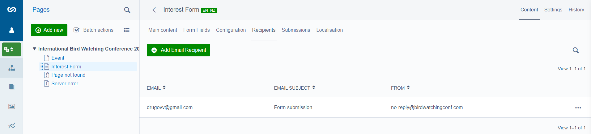

Hello, Catch team! I appreciate the enjoyable technical task and look forward to your feedback.

For the task, I came up with the "Bird Watching Conference 2024" event. Accordingly, the Lead form collects data from those interested in attending the event.

If you're eager to see the final result, I've already uploaded everything to the cloud and created the Android file (assuming you have an Android smartphone):
- **Demo website:**  http://birdwatcherconf.australiacentral.cloudapp.azure.com/
- **Demo admin:**  http://birdwatcherconf.australiacentral.cloudapp.azure.com/admin/ (admin : 0zXN8w6x1Absa[Ak)
- **Android App:** [app-debug.apk](docs/_assets/app-debug.apk) (yes, you have to ignore all the warning during the installation)

## Solution and Estimations

- [Solution](docs/1-solution.md)
- [Estimations](docs/2-deliery-estimate-and-timeline.md)

## Web Part installation
I use SilverStripe 5,so the prerequisites are PHP>=8.1,<=8.3 and MySQL>=5.6. More details:
https://docs.silverstripe.org/en/5/getting_started/server_requirements/

1. Put _birdwatcherconf_web_ folder into the _www_ folder or analogy. Alternatively, you can use the original repository for the web part to clone: https://github.com/drugovvg/birdwatcherconf_web
2. Ensure that your VirtualHost settings or analogy Directory is set to _birdwatchercon_web/public_ or similar.
3. Create an _.env_ file in the root _birdwatcherconf_web_ directory with the content similar to the following:
```
# DB credentials
SS_DATABASE_CLASS="MySQLDatabase"
SS_DATABASE_SERVER="localhost"
SS_DATABASE_USERNAME=""
SS_DATABASE_PASSWORD=""
SS_DATABASE_NAME=""

# WARNING: in a live environment, change this to "live" instead of dev
SS_ENVIRONMENT_TYPE="dev"
SS_DEFAULT_ADMIN_USERNAME="admin"
SS_DEFAULT_ADMIN_PASSWORD="admin"
```
4. Import the mysqldump _birdwatcherconf_web/birdwatcherconf_dump.zip_ into your MySQL DB
5. Update or add your email for receiving submission forms through the CMS admin:


## App Part installation

1. Put _birdwatcherconf_app_ folder somewhere. Alternatively, you can use the original repository for the app part to clone: https://github.com/drugovvg/birdwatcherconf_app
2. Install Cordova: https://cordova.apache.org/docs/en/12.x/guide/cli/installation.html
2. Make sure that you have all the prerequisites for building apps: https://cordova.apache.org/docs/en/12.x/guide/cli/index.html#install-pre-requisites-for-building
2. Build apps: https://cordova.apache.org/docs/en/12.x/guide/cli/index.html#build-the-app
3. Emulate and run apps: https://cordova.apache.org/docs/en/12.x/reference/cordova-cli/index.html#cordova-run-command
