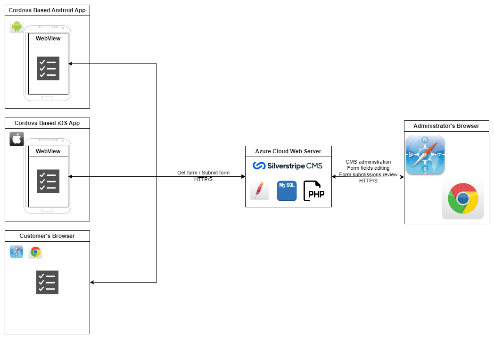
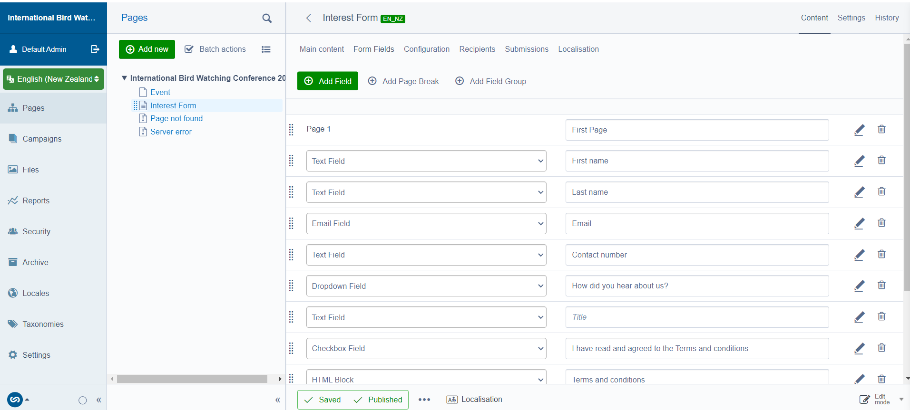
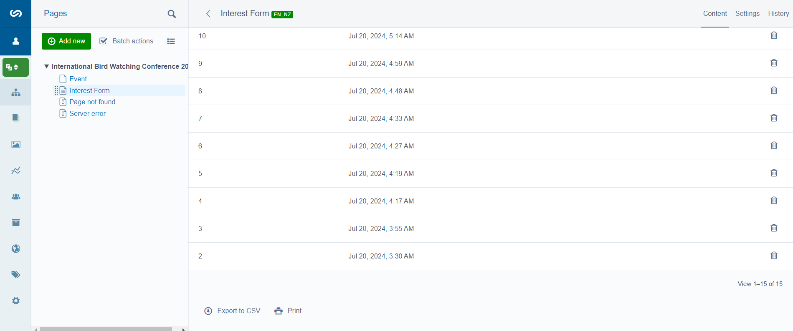
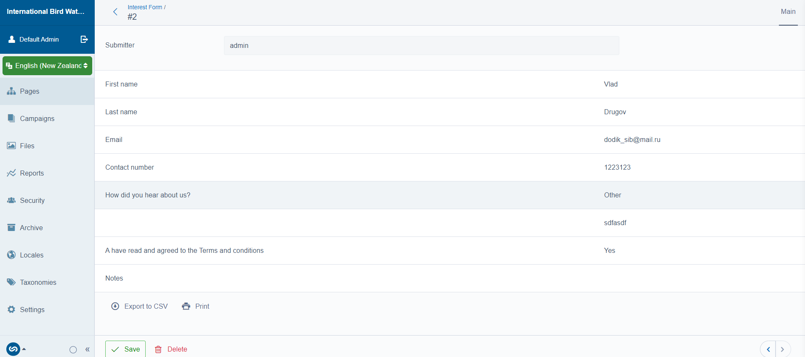
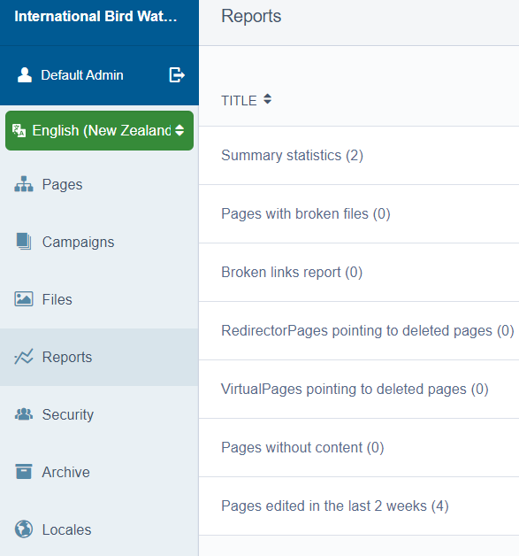

# High-Level Design

Considering the small task scope and time constraints, the primary strategy will be to maximise the use of ready-made, proven solutions and ease of implementation.

As a basis, I decided to take Silverstripe, which runs on the LAMP stack, has many plugins, and is widely used by digital studios and e-commerce. Plus, an essential component in the choice is that I have a lot of hands-on experience in it.

## Web

Although Silverstripe allows you to use advanced FrontEnds, such as Next.js (which I highly recommend), React, etc., I will deliberately not use them since they will require customisation to integrate with ready-made modules, such as the forms module. Thus, I trade off the simplicity of the solution for the sake of UX.

## Mobile

I use Apache Cordova, a solution built on WebView for the mobile application. Moreover, I will use it as a thin client without implementing logic in the mobile application. Mobile apps will immediately open a mobile-responsive form on the remote website. Here, I again make a trade-off in the direction of simplification for the sake of a native mobile experience.

My fictional example is the Bird Watching Conference. Their UX and load requirements are not high, but if they were, I would go with the Mobile First approach. I would implement the OMNI solution with [Expo](https://docs.expo.dev/) (React Native) and use GraphQL for integration with Silverstripe. I would change Apache to Nginx and take care of caching.

# Brief
- **Demo website:**  http://birdwatcherconf.australiacentral.cloudapp.azure.com/

- **Demo admin:**  http://birdwatcherconf.australiacentral.cloudapp.azure.com/admin/ (admin : 0zXN8w6x1Absa[Ak)

- **Android App:** [app-debug.apk](_assets/app-debug.apk)

The proposed solution combines the speed of development using prominent Silverstripe CMS with ready-made components, which gives a low deployment cost due to using a standard technology stack. It also minimises the need to contact the studio for changes, so the customer, using Silverstripe CMS, can independently add new localisations, change, add, and delete fields in the form and add entire pages.

The main form of Lead collection saves each lead in the database and displays it in the CMS. It also sends it to the email specified in the CMS, ensuring data safety and instant notification. The customer can deactivate both of these options in the CMS.

The customer does not have to worry about changing and publishing mobile applications whenever the form is altered since mobile applications get the adapted web form from the site.

The form is also protected from spam using Google reCAPTCHA v3 technology.

The site is perfectly optimised for search engines, thanks to the functionality that comes out of the box CMS and to additional modules for Google Site Maps and JSON LD.

The solution is distinguished by good observability, firstly due to its placement in Azure, which provides monitoring and alerting tools, but also due to the Reports CMS module, which allows the customer to identify many problems with the content independently.

# Risks
The main limitation of the solution is its dependence on the website, which will be a point of complete failure for mobile applications if it is unavailable.

Also, the current solution is designed for something other than heavy loads and will significantly degrade even with average traffic values.
